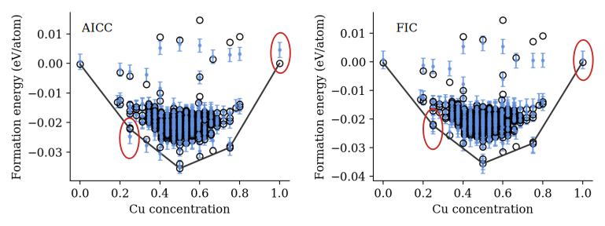

# FIC vs AICC

| Quality indicator | AICC (meV/atom) | FIC (meV/atom) |
| ----------------- | ----: | ---: |
| RMSE | 1.02 | 1.20 |
| GCV | 1.04 | 1.20 |

---

# FIC vs AICC

* FIC has a higher value for common quality indicator such as root-mean-square-error and
generalized cross valudation score.

* By visual inspection it recovers the convex hull much better.

* **Important!** FIC does not recover the convex hull better because it uses a more complicated
model and thus is more likely to overfit. If that was the case, RMSE would have been lower for FIC than AICC.

**Which model is better?**